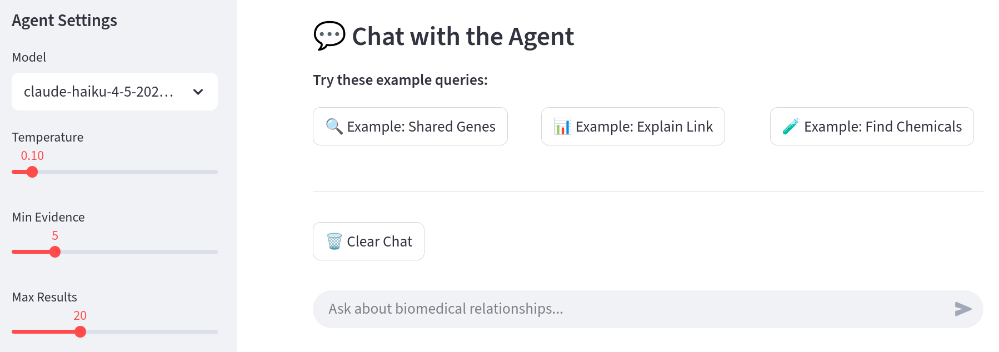
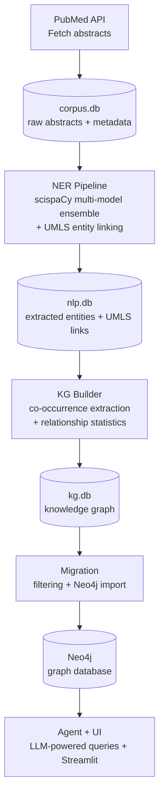

# Biomedical Knowledge Graph Builder with LLM Agent

[](https://github.com/msajitz/biomed-kg-agent/actions)
[](https://www.python.org/downloads/)
[](LICENSE)
[](https://github.com/psf/black)

Build knowledge graphs from biomedical literature and query them with an LLM agent.

Synthesizing findings across thousands of biomedical papers is a manual bottleneck. This tool extracts entities and co-occurrence relationships from PubMed abstracts, then exposes the resulting knowledge graph through an LLM agent that answers questions grounded in cited literature with mandatory document provenance.

**TL;DR:** PubMed -> scispaCy NER + UMLS linking -> co-occurrence KG -> Neo4j -> agent query with cited sources.

**Stack:** Python 3.12, scispaCy, UMLS, Neo4j, Claude (Anthropic), Streamlit, SQLite


*Agent UI: Streamlit interface for querying the biomedical knowledge graph*

## Example Agent Output

*Query: "What genes are associated with both breast cancer and ovarian cancer?"*

<details>
<summary>Full agent response (click to expand)</summary>

**BRIEF SUMMARY**

Several genes are strongly associated with both breast cancer and ovarian cancer, with HER2 showing the highest evidence (1,074 documents). The BRCA genes (BRCA1 and BRCA2) are particularly notable for their role in hereditary susceptibility to both cancers, while p53 mutations are enriched in both disease types. PARP, a DNA repair protein, is also implicated in both cancers, particularly in the context of BRCA-mutant tumors.

**SELECTION RATIONALE**

Selecting genes with >50 documents of combined evidence across both cancer types. HER2 and HER2 protein are closely related entities (both represent the same gene product); I'm presenting HER2 as the primary result since it has higher evidence. BRCA (163 docs) represents the broader gene family; BRCA1 (94 docs) and BRCA2 (57 docs) are specific genes within this family. All results exceed the 50-document threshold and represent distinct genes with clear relevance to both cancers.

**DETAILED RESULTS**

- **HER2** — 1,074 documents; HER2 is amplified or overexpressed in approximately 20-30% of breast cancers and is studied in HER2-overexpressing breast and ovarian cancer cells and tumor xenografts. PARP inhibitor monotherapy is evaluated in HER2-negative breast cancer subtypes and ovarian cancer [30725819, 34957911, 35335736, 35435784, 39600235, 40147045]

- **BRCA** — 163 documents; BRCA mutations are associated with both breast and ovarian cancer development. PARP inhibitors have changed the treatment landscape for advanced ovarian tumors with BRCA mutations and are effective in BRCA 1/2-mutated epithelial ovarian cancer by blocking DNA repair pathways [34907091, 35340889, 35367197, 35641483, 35897700, 37148685]

- **BRCA1** — 94 documents; BRCA1 mutations are associated with increased breast and ovarian cancer risk. Germline variants in BRCA1 play important roles in the development of breast and ovarian cancer in particular, and BRCA1-associated breast cancers carry a higher propensity of CNS metastasis [34044732, 35340889, 35343191, 35772246, 36928661, 37334492]

- **p53** — 92 documents; TP53 mutations are enriched in both triple-negative breast cancer and high-grade serous ovarian cancer. Crizotinib combination therapies are emphasized in cancers with high prevalence of p53 mutations, such as TNBC and HGSOC [35393784, 35658233, 35870568, 39001541, 40019487, 40435111]

- **PARP** — 156 documents; PARP1 is amplified in approximately 22.8% of breast cancers. PARP inhibitors (olaparib, rucaparib, niraparib) are approved for epithelial ovarian cancer and are used for breast cancer treatment, particularly in BRCA-mutant tumors [35367197, 35442700, 35466854, 35641483, 35670707, 35834102]

- **BRCA2** — 57 documents; BRCA2 mutations are associated with increased breast and ovarian cancer risk. Germline variants in BRCA2 play important roles in the development of breast and ovarian cancer, with different mutations associated with varying cancer risks [34044732, 35343191, 35764927, 35772246, 39107554, 39461277]

</details>

## Use Cases

- **Literature exploration** — Query evidence-backed associations across thousands of abstracts
  *Example: "What genes are associated with both breast cancer and ovarian cancer?"*
- **Evidence inspection** — Summarize the literature supporting a specific graph connection
  *Example: "How is BRCA1 linked to breast cancer?"*
- **Pattern discovery** — Explore co-occurrence patterns across genes, diseases, and chemicals
  *Example: "What chemicals are related to BRCA1?"*

> **Approach:** This is a research exploration tool for biomedical literature analysis. The knowledge graph captures sentence-level co-occurrence relationships.

## Features

- **Literature ingestion** (PubMed) with MeSH terms, DOIs, and author keywords
- **Biomedical NER** via multi-model scispaCy ensemble (chemicals, diseases, genes, anatomy)
- **Co-occurrence extraction** with sentence-level evidence and frequency statistics
- **Knowledge graph** storage in SQL and Neo4j
- **LLM agent** for natural language research queries
- **Streamlit web UI** for interactive querying

All agent queries are pre-validated with mandatory document provenance - no dynamic Cypher generation. See [Agent](docs/agent.md) for details.

## Architecture



## Prerequisites

- **Python 3.12**, [Poetry](https://python-poetry.org/)
- **Neo4j 5.x+**: Self-hosted or [Neo4j Aura](https://neo4j.com/cloud/aura/) (required for agent + UI)
- **ANTHROPIC_API_KEY**: Required for the LLM agent (optional for CLI-only pipeline)
- **UMLS**: Entity linking uses scispaCy's built-in UMLS linker - no API key or UMLS license needed

### System Requirements

- **RAM**: 16 GB minimum. The pipeline peaks at ~10 GB for the default 20K-abstract build,
  dominated by the UMLS linker model (~6 GB). Entity data adds ~0.5 GB per 20K abstracts.
  For larger corpora (100K+), 32 GB is recommended. CPU-only; no GPU required.
- **Disk**: ~2 GB one-time download (scispaCy models + UMLS knowledge base),
  plus ~750 MB per 20K abstracts (SQLite databases).

## Getting Started

1. Clone and install:
```bash
git clone https://github.com/msajitz/biomed-kg-agent.git
cd biomed-kg-agent
poetry install
```

2. Run a demo pipeline (~5 min, no Neo4j needed):
```bash
make quick
```
This fetches 100 PubMed abstracts, runs multi-model NER with UMLS entity linking, and builds a co-occurrence knowledge graph - all as SQLite databases in `data/`.

> **Data scale**: For meaningful exploration, use `make build` for a 20K-abstract full pipeline (~2 hours).

3. (Optional) Set up Neo4j + agent:
```bash
cp .env.example .env   # edit with your Neo4j credentials and Anthropic API key
make migrate DIR=<output_dir>
poetry run streamlit run src/biomed_kg_agent/ui/app.py
```
Replace `<output_dir>` with the directory printed by the pipeline (e.g., `data/quick_20250225_143000`).

For step-by-step control and all CLI options: `poetry run biomed-agent --help`

## Makefile Shortcuts

For convenience, the Makefile wraps the most common workflows:

| Command | Description |
|---------|-------------|
| `make quick` | Full pipeline, 100 abstracts (~5 min) |
| `make build` | Full pipeline + Neo4j migration, 20K abstracts (~2 hours) |
| `make demo SEARCH_TERM="diabetes"` | Custom topic demo, 100 abstracts (requires SEARCH_TERM) |
| `make continue DIR=data/...` | Resume from existing run directory |
| `make migrate DIR=data/...` | Migrate a KG to Neo4j |
| `make test` | Run pytest + pre-commit checks |
| `make clean` | Remove generated data |

## Environment Variables

| Variable | Required | Default | Description |
|----------|----------|---------|-------------|
| `NEO4J_URI` | For agent/UI | `bolt://localhost:7687` | Neo4j connection URI |
| `NEO4J_USER` | For agent/UI | `neo4j` | Neo4j username |
| `NEO4J_PASSWORD` | For agent/UI | - | Neo4j password |
| `ANTHROPIC_API_KEY` | For agent/UI | - | Anthropic API key (model config: [Agent docs](docs/agent.md#configuration)) |
| `ANTHROPIC_MODEL` | No | `claude-haiku-4-5-20251001` | LLM model for agent (see [Agent docs](docs/agent.md#configuration)) |
| `PUBMED_EMAIL` | No | - | Recommended for bulk PubMed downloads |
| `SQLITE_DB_PATH` | No | `data/nlp.db` | SQLite path for cited abstract lookup |

See [`.env.example`](.env.example) for a quick-start template.

## Development

```bash
poetry install --with dev
make test                      # pytest + pre-commit
poetry run pre-commit run -a   # lint/format checks only
```

211 tests, 85%+ line coverage on pipeline, NER, and KG modules. Agent and UI modules require live services and are validated separately ([agent validation](docs/agent.md#validation)).

## Documentation

- [Agent](docs/agent.md) - Agent architecture, tools, and customization
- [Data Model](docs/data_model.md) - Knowledge graph schema and query patterns
- [Known Limitations](docs/known_limitations.md) - Current limitations and workarounds
- [Validation](docs/validation.md) - NER performance metrics and reproducibility
- [Scripts](scripts/README.md) - Benchmarking, manual verification, and utility scripts
- [Validation Metrics](notebooks/validation_metrics.ipynb) - NER/linking coverage results (see [methodology](docs/validation.md))
- [Agent Tool Routing & Grounding Validation](notebooks/agent_tool_routing_grounding_validation.ipynb) - Tool-routing validation and hallucination spot-checks

To run notebooks: `poetry install --with dev,notebook`

## Acknowledgments

- [scispaCy](https://allenai.github.io/scispacy/) - Neumann et al., 2019. Biomedical NER and entity linking.
- [UMLS](https://www.nlm.nih.gov/research/umls/) - Unified Medical Language System (NLM/NIH)
- [Neo4j](https://neo4j.com/) - Graph database
- [Anthropic Claude](https://www.anthropic.com/) - LLM agent backbone

## License

This project is licensed under the Apache 2.0 License - see the [LICENSE](LICENSE) file for details.
