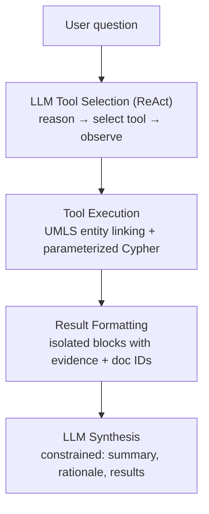

# LLM Agent for Biomedical Knowledge Graph Queries

This document describes the LLM agent that translates natural language questions into structured queries over a biomedical knowledge graph (KG) stored in Neo4j.

## Architecture Overview

The agent is a **ReAct tool-routing agent** built with [LangGraph](https://langchain-ai.github.io/langgraph/) and Anthropic Claude. It does not generate Cypher directly; instead, the LLM selects from pre-validated query tools and the results are grounded in graph evidence with mandatory provenance.



**Key source files:**

- **`src/biomed_kg_agent/agent/queries.py`** - Parameterized Cypher queries (reliable, tested, read-only)
- **`src/biomed_kg_agent/agent/core.py`** - LLM wrapper: tool definitions, entity resolution, output formatting, ReAct agent

The system prompt (~170 lines) is currently inline in `core.py`. A production system would load it from a versioned template file to enable A/B testing and non-code-change iteration.

## Why Structured Tools Instead of LLM-Generated Cypher?

The agent uses pre-validated Cypher queries wrapped as LangChain tools rather than LLM-generated Cypher (e.g., LangChain's `GraphCypherQAChain`).

**Rationale:**

- **Reliability**: Pre-validated queries avoid common LLM Cypher failures (wrong property names, invalid syntax, hallucinated schema elements)
- **Safety**: All queries use read-only `MATCH` patterns; provenance is included by design
- **Predictability**: Consistent, tested execution with parameterized inputs
- **Auditability**: Every query path is reviewable; no opaque LLM-generated code at runtime

**Trade-offs:**

- Limited to pre-defined query patterns (no ad-hoc multi-hop traversals)
- Users must phrase questions within tool capabilities
- Adding new query patterns requires code changes

**Alternatives considered:**

| Approach | Pros | Cons |
|----------|------|------|
| Text-to-Cypher (`GraphCypherQAChain`) | Higher flexibility | Brittle on schema-heavy biomedical KGs; hard to guarantee provenance |
| GraphRAG | Good for open-ended summarization; complementary to structured tools | Requires embedding pipeline + vector store; out of scope for MVP |

## Query Lifecycle

What happens when a user asks: *"What genes are linked to breast cancer?"*

1. **Tool selection** - The LLM's ReAct loop selects `FindGenesForDisease(disease="breast cancer")`
2. **Entity resolution** (inside tool) - The UMLS linker maps "breast cancer" -> CUI `C0006142` (Malignant neoplasm of breast)
3. **Cypher execution** - A parameterized query runs against Neo4j:

```cypher
MATCH (d:Entity {entity_type: 'disease'})-[r:CO_OCCURS_WITH]-
    (g:Entity {entity_type: 'gene'})
WHERE (d.umls_cui IN $disease_cuis
       OR toLower(d.name) CONTAINS toLower($disease))
  AND r.docs_count >= $min_evidence
RETURN g.name, r.docs_count, r.evidence_sentences, r.sample_doc_ids
ORDER BY r.docs_count DESC LIMIT $limit
```

4. **Result formatting** - Each result is wrapped in an isolated block with entity name, evidence counts, up to 5 diverse evidence sentences, and document IDs
5. **LLM synthesis** - Claude generates a response constrained to three sections (summary, selection rationale, detailed results) using only data from the tool output
6. **Provenance** - Document IDs from all tool calls are collected, deduplicated, and returned alongside the answer

## Agent Tools

The agent has 5 structured query tools. `FindEntityNeighbors` is the **default**; the others are specialized shortcuts or intersection queries.

| Tool | Input | Use Case |
|------|-------|----------|
| **FindEntityNeighbors** | entity, optional type filter | General exploration - works for any entity type (default) |
| **FindGenesForDisease** | disease name | Optimized gene <-> disease query |
| **FindDiseasesForGene** | gene name | Optimized disease <-> gene query |
| **ExplainRelationship** | two entity names (comma-separated) | Detailed evidence for a specific entity pair |
| **FindSharedNeighbors** | two entities, optional type filter | Graph intersection - entities connected to BOTH inputs |

### Example Queries

- "What genes are linked to breast cancer?" -> `FindGenesForDisease`
- "What diseases involve BRCA1?" -> `FindDiseasesForGene`
- "What is tamoxifen related to?" -> `FindEntityNeighbors` (general exploration)
- "What biological processes involve BRCA1?" -> `FindEntityNeighbors(entity='BRCA1', entity_type='biological_process')`
- "Explain the relationship between HER2 and breast cancer" -> `ExplainRelationship`
- "What genes are implicated in both breast and ovarian cancer?" -> `FindSharedNeighbors`

### Tool Routing

The LLM selects tools via a system prompt that defines:

- **Entity type vocabulary**: gene, disease, chemical, biological_process, cell_type, anatomy, organism, and others
- **Default tool**: `FindEntityNeighbors` for any entity type; specialized tools are shortcuts for common gene/disease patterns
- **Follow-up behavior**: Always call tools with fresh queries - never answer from conversation memory alone
- **Multi-turn context**: Conversation history is configurable via `max_history_messages` (default: 10 messages / 5 turns). This is sufficient for typical exploratory sessions (3–4 turns) but power users on longer sessions may increase the limit via the UI slider (2–30 messages). Trade-off: longer history increases token cost and latency.

## Entity Resolution

The agent resolves user input to graph entities using **UMLS CUI-first lookup with case-insensitive name fallback**, applied at query time (not just at ingestion).

### Resolution Flow

1. **UMLS linking** - scispaCy's `EntityLinker` maps the query term to UMLS CUI(s)
   - Example: "breast cancer" -> `C0006142` (Malignant neoplasm of breast)
2. **Parameterized Cypher** - The query uses both CUI and name matching for recall:

```cypher
WHERE (node.umls_cui IN $cuis OR toLower(node.name) CONTAINS toLower($term))
```

3. **Graceful degradation** - If UMLS linking fails or is disabled, queries fall back to substring matching only

### Why Query-Time Linking?

Query-time UMLS linking provides entity normalization at query time, mirroring the normalization applied during ingestion. When a user searches for "breast cancer," UMLS linking maps it to CUI C0006142, which retrieves all text variants stored in the KG under that CUI (e.g., "malignant neoplasm of breast", "breast carcinoma", "BC", etc.). This dramatically improves recall -- a single canonical query term retrieves entities that appeared under multiple variant phrasings in the source literature. Without query-time linking, users would need to know and search for each variant independently, or the system might miss relevant results.

### Limitations

- **UMLS coverage gap**: ~35% of unique entities in the KG lack UMLS CUIs and rely on substring fallback only (see [validation notebook](../notebooks/validation_metrics.ipynb); measured on a 1,000-abstract demo corpus). Common unlinked terms include domain abbreviations (TNBC, ADCs, T-DXd) and generic terms filtered during KG construction.
- CUI matching misses variants with different CUIs (e.g., "p53" vs "p53-mutant")
- Substring fallback misses true synonyms (e.g., "aspirin" vs "acetylsalicylic acid")
- Single ontology: UMLS only. Integration with Gene Ontology (GO) for biological processes, MeSH for disease hierarchies, and ChEBI for chemicals would improve recall for domain-specific queries
- UMLS linker cold start: ~30-40s on first load (scispaCy loads the UMLS linker files into memory); subsequent queries are fast

## Grounding and Output Constraints

The agent uses a structured system prompt (~170 lines) to constrain responses to graph evidence. In a [7-query evaluation](../notebooks/agent_tool_routing_grounding_validation.ipynb) (tool routing & grounding validation), 0/53 cited entities were hallucinated (all traced back to tool output). Document count accuracy and evidence paraphrasing quality were not formally validated.

### Output Structure

Every response follows three sections:

1. **Brief Summary** (2-3 sentences) - Allowed synthesis patterns: ranking, aggregation, categorization, comparison. Forbidden: new medical claims, mechanisms not stated in evidence, modified entity names.
2. **Selection Rationale** - Why specific results were included or excluded, with explicit thresholds (e.g., "selecting drugs with >100 docs").
3. **Detailed Results** - One bullet per entity, using exact names and counts from tool output only.

### Anti-Hallucination Guardrails

- **Isolated result blocks**: Each tool result is formatted with clear boundaries (`RESULT N (ISOLATED - DO NOT MIX WITH OTHER RESULTS)`). The LLM is instructed to use data from one result block only per bullet point.
- **Entity name discipline**: The LLM must use the exact `ENTITY NAME` field from tool output. Extracting names from evidence text or combining names across results is explicitly forbidden.
- **Evidence-only descriptions**: Result descriptions must draw only from evidence sentences, not LLM general knowledge.
- **Mandatory tool use on follow-ups**: The LLM must always call tools for follow-up questions - it cannot answer from conversation memory alone.

These constraints reduce the risk of the LLM synthesizing plausible-sounding but unsupported biomedical claims.

## Provenance Tracking

Every agent tool call returns:

- **Document IDs** - Source document identifiers (configurable via `max_doc_ids_per_result`, default 10)
- **Evidence sentences** - Sample sentences supporting the relationship
- **Evidence counts** - Number of documents and co-occurrence sentences

Document IDs are collected across all tool calls in a query, deduplicated, and returned alongside the answer. Users can verify any claim by reviewing the cited abstracts in the web UI.

## Validation

Agent-level validation on 7 breast cancer-focused queries ([tool routing & grounding validation notebook](../notebooks/agent_tool_routing_grounding_validation.ipynb)):

| Metric | Value | Notes |
|--------|-------|-------|
| Tool routing | 7/7 correct | 4 of 5 tools exercised (`FindSharedNeighbors` not tested) |
| Entity hallucination | 0/53 (0%) | Every cited entity traced to tool output |
| Selection rate | 53/90 (59%) | Agent filters results, not a passthrough |
| Provenance | 100% | All responses include document IDs |

**Not validated**: document count accuracy, evidence paraphrasing quality (require manual review).

**Validation scripts:**

- [`scripts/verify_agent.py`](../scripts/verify_agent.py) - End-to-end agent validation
- [`scripts/verify_agent_queries.py`](../scripts/verify_agent_queries.py) - Direct query validation against Neo4j

For KG construction and NLP pipeline metrics (UMLS linking coverage, entity normalization, relationship evidence distribution), see [`notebooks/validation_metrics.ipynb`](../notebooks/validation_metrics.ipynb).

## Configuration

| Setting | Default | How to Change |
|---------|---------|---------------|
| Model | `claude-haiku-4-5-20251001` | `ANTHROPIC_MODEL` env var, Python API, or UI dropdown |
| Temperature | `0.1` | Python API or UI slider |
| Min evidence | `5` | Python API or UI slider |
| Max results | `20` | Python API or UI slider |
| UMLS linking | `True` | Python API or UI toggle (UI defaults to off for faster startup) |
| Max doc IDs per result | `10` | Python API only |
| Max history messages | `10` | Python API or UI slider |

Compatible with any Anthropic Claude model. See [`.env.example`](../.env.example) for all environment variables and [Anthropic's model docs](https://docs.anthropic.com/en/docs/models-overview) for available models.

## Customizing Tools

The default tools are tailored for biomedical KGs with gene/disease/chemical entity types. For different KG schemas, customize:

1. **Cypher queries** - `src/biomed_kg_agent/agent/queries.py`
   - Functions accept a Neo4j driver and query-specific parameters
   - Return dicts with results (include provenance where applicable)

2. **LangChain tool definitions** - `src/biomed_kg_agent/agent/core.py`
   - Wrap Cypher functions as LangChain `Tool` or `StructuredTool` objects
   - Provide clear descriptions so the LLM selects the appropriate tool

Cypher clause construction uses f-strings for structural composition (e.g., `WHERE {where_clause}`); all user inputs are parameterized via `$param` to prevent injection.

The architecture is domain-agnostic; only the specific queries and entity types need adaptation.

## Possible Extensions

Not currently planned, but natural directions if the project continues:

- **Relation extraction**: Replace sentence-level co-occurrence with a relation extraction model (e.g., BioBERT, PubMedBERT fine-tuned on RE tasks) for typed predicates ("treats", "inhibits", "upregulates")
- **Multi-hop traversal**: Path-finding queries (e.g., "How is gene X connected to drug Y through biological processes?")
- **Evaluation framework**: Formal benchmark with routing accuracy, provenance completeness, and answer relevance metrics on a curated query set

## Known Limitations

Top limitations (see [`known_limitations.md`](known_limitations.md) for the full list):

- **Co-occurrence only**: Relationships are sentence-level co-occurrence, not typed predicates (e.g., "treats", "inhibits"). The LLM interprets evidence to characterize relationships.
- **Fixed query patterns**: No ad-hoc multi-hop traversal. Users must phrase questions within tool capabilities.
- **Evidence sampling**: The agent surfaces all stored evidence sentences per result (up to 5) to the LLM, with an explicit label showing how many are stored vs. total co-occurring sentences. Descriptions are constrained to paraphrase or quote the shown evidence only. However, 5 sentences from a relationship spanning dozens of documents is still a sample - descriptions may not capture every facet of the relationship.
